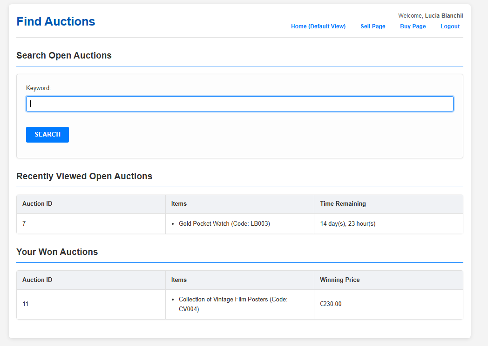
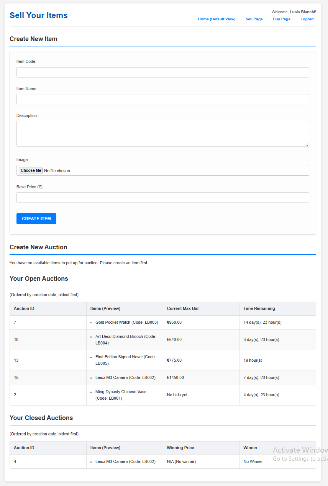
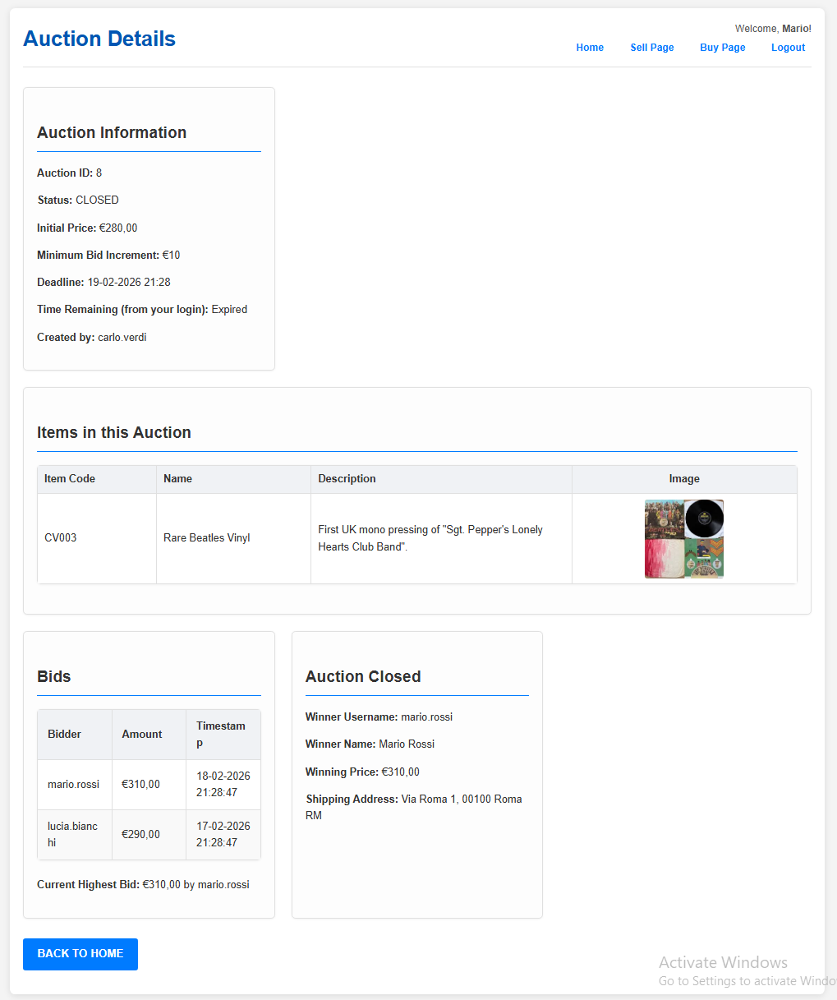
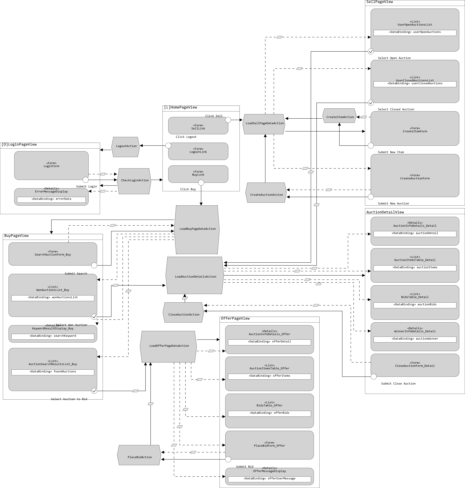
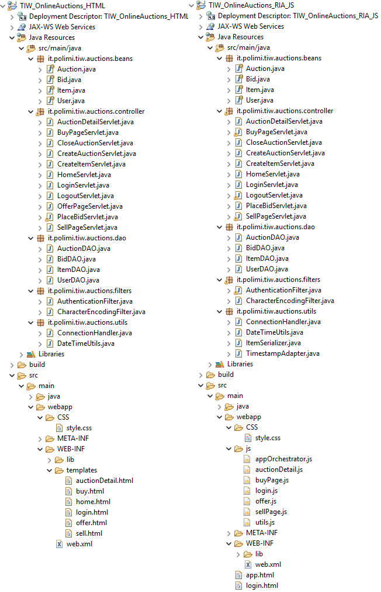
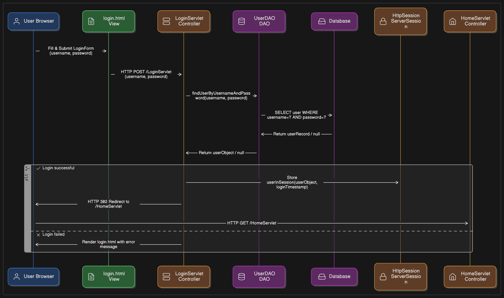
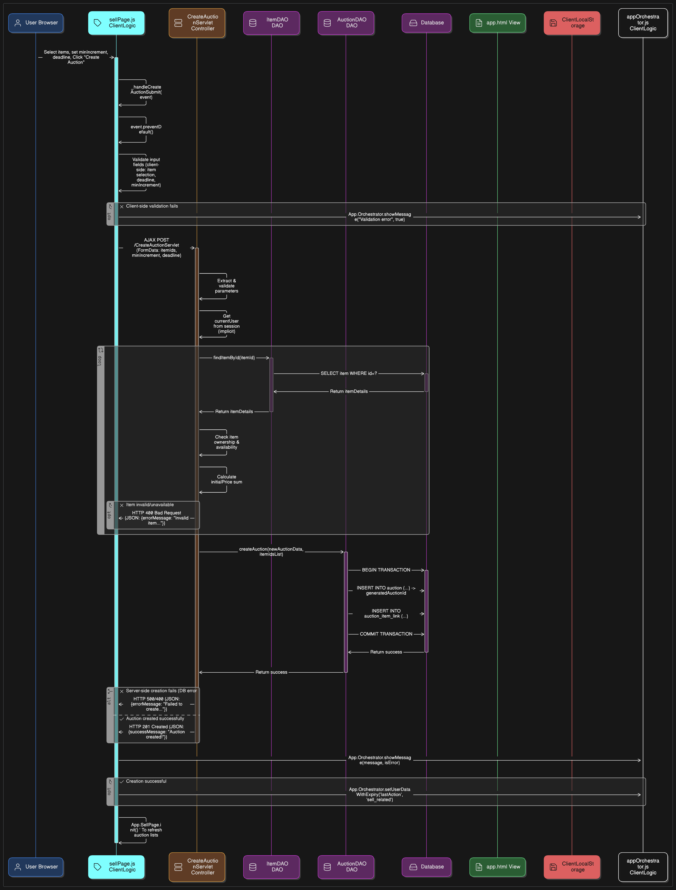
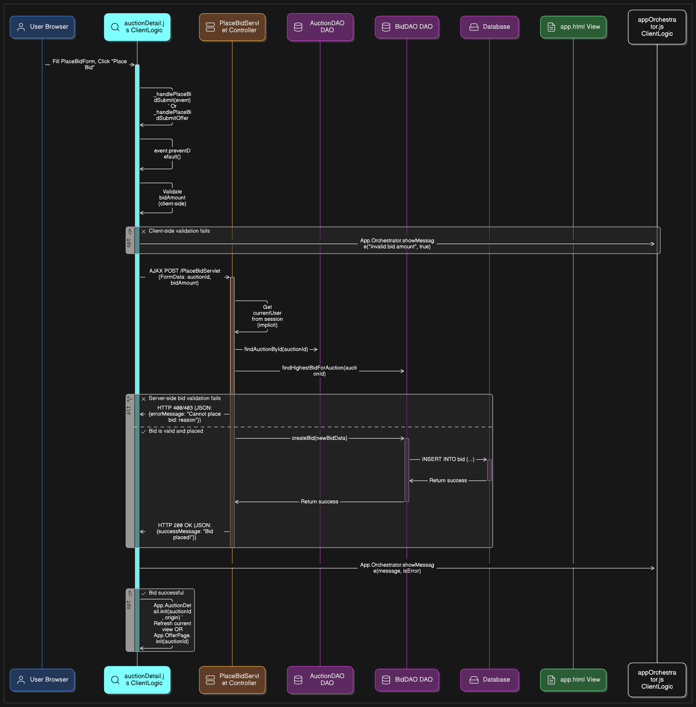

<div align="center">
  
  
  # Online Auctions Web Application
  
  **Tecnologie Informatiche per il Web (TIW) - Politecnico di Milano**  
  *Academic Year 2024-2025 | Professor: Piero Fraternali*
</div>

---

## 📖 About The Project

This repository contains the final project for the **Web Technologies (TIW)** course. The project is a web-based application that allows users to manage and participate in online auctions. 

To demonstrate full-stack web development proficiency, the application has been developed in **two distinct versions** using different architectural paradigms:

1. **Pure HTML Version (Server-Side Rendering):** Built using Java Servlets and Thymeleaf. Every user interaction results in a full page reload processed by the server.
2. **RIA Version (Rich Internet Application / SPA):** Built using Vanilla JavaScript, AJAX, and Java Servlets serving JSON data. The application runs entirely on a single HTML page (`app.html`), dynamically updating the DOM without page reloads.

## ✨ Key Features

* **Authentication:** Secure user login and session management.
* **Selling Items:** Users can create new items and group them to create custom auctions. Features include setting minimum bid increments and setting expiration dates.
* **Buying Items:** Users can search for active auctions via keywords, view auction details, and place competitive bids.
* **Auction Lifecycle Management:** Creators can manually close auctions once the deadline has passed to determine the winner based on the highest bid.
* **Client-Side Storage (RIA Only):** Implements LocalStorage to remember the user's last action and previously visited open auctions for up to 30 days, optimizing the user experience upon returning to the site.


## 📸 User Interface Preview

Here is a glimpse of the ria application's user interface (the pure html is quite the same). The design is kept clean, responsive, and intuitive.

| Login Page | Find Auctions (Buy Page) |
|:---:|:---:|
|  |  |


| Sell your items (Sell Page) | See Auctions (Detail Page) |
|:---:|:---:|
|  |  |


## 🛠️ Tech Stack

### Common Backend
* **Java EE (Servlets)**
* **JDBC** (Java Database Connectivity)
* **MySQL** (Relational Database)
* **Apache Tomcat** (Web Server)

### Frontend - HTML Version
* **HTML5 & CSS3**
* **Thymeleaf** (Server-side Java template engine)

### Frontend - RIA Version
* **Vanilla JavaScript (ES6+)**
* **AJAX / Fetch API**
* **Gson** (Java library to convert Java Objects into JSON)

## 📂 Repository Structure

```text
online-auctions/
├── database/                   # Database schema setup script (auction_db_setup.sql)
├── documentation/              # Project specs, reports, and architecture diagrams
│   ├── diagrams/               # IFML, Component, and Sequence diagrams
│   ├── project_report.pdf      # Detailed project documentation
│   └── spec.pdf                # Original assignment specifications
├── pure-html-version/          # Source code for the Server-Side Rendered application
└── ria-js-version/             # Source code for the Client-Side Rendered (SPA) application
```

## 🏗️ Architecture & Design

### IFML Design (HTML Version)
*The Interaction Flow Modeling Language diagram representing the navigation and logic flow of the Pure HTML version.*

<p align="center">
  
</p>

### System Components
*Overview of the ViewComponents and Action components.*

<p align="center">
  
</p>

### Sequence Diagrams (Examples)
<details>
  <summary><b>Click to expand Sequence Diagrams</b></summary>
  
  **1. Login Flow (HTML)**
  <br>
  
  
  **2. Create New Auction (RIA Version)**
  <br>
  
  
  **3. Place an Offer (RIA Version)**
  <br>
  
  
  *(More sequence diagrams are available in the `documentation/diagrams/` folder).*
</details>
Here is the updated and highly detailed **Getting Started** section. I have expanded the instructions from scratch so that anyone (even someone without Tomcat or MySQL already set up) can follow along. I also included the specific `web.xml` database configuration and added step-by-step guides for **Eclipse**, **IntelliJ IDEA**, and **VS Code**.

You can replace the previous `## 🚀 Getting Started` section in your `README.md` with this comprehensive version:

***


## 🚀 Getting Started & Installation Guide

This project is a classic Java Enterprise (Java EE) application. It does not use Maven or Spring Boot, so it requires a manual setup of the Web Server (Tomcat) and the Database (MySQL). Follow these steps carefully to run the project locally.

### 1. Prerequisites
Before starting, ensure you have the following installed on your machine:
* **Java Development Kit (JDK):** Version 11 or higher. [Download here](https://adoptium.net/).
* **MySQL Server:** Version 8.0+. [Download here](https://dev.mysql.com/downloads/installer/).
* **Apache Tomcat:** Version 9.0 (Recommended for TIW course). Download the "Core" `.zip` file and extract it to a folder on your PC (e.g., `C:\Tomcat9`). [Download here](https://tomcat.apache.org/download-90.cgi).

### 2. Database Setup
1. Start your local MySQL Server.
2. Open **MySQL Workbench** (or your preferred MySQL CLI/GUI tool).
3. Open the setup script provided in this repository: `database/auction_db_setup.sql`.
4. Execute the entire script. This will automatically create the `online_auctions_db` schema, set up all the necessary tables, and establish foreign key constraints.

### 3. Configure Database Credentials
The application connects to MySQL using credentials defined in the deployment descriptor (`web.xml`). By default, it is configured for a user `root` with the password `67934`.

If your local MySQL uses a different password, you **must** update it in both projects:
* `pure-html-version/src/main/webapp/WEB-INF/web.xml`
* `ria-js-version/src/main/webapp/WEB-INF/web.xml`

Find the following `<context-param>` blocks and change the `<param-value>` to match your local MySQL credentials:

```xml
<!-- Database User -->
<context-param>
    <param-name>dbUser</param-name>
    <param-value>root</param-value> <!-- Change this if your username is different -->
</context-param>

<!-- Database Password -->
<context-param>
    <param-name>dbPassword</param-name>
    <param-value>67934</param-value> <!-- Change this to YOUR local MySQL password -->
</context-param>
```

### 4. Running the Application (Choose your IDE)

The project is natively structured as an **Eclipse Dynamic Web Project**, but it can be run on IntelliJ or VS Code as well.

<details open>
  <summary><b>Option A: Using Eclipse (Recommended for this course)</b></summary>
  
  1. Download and install **Eclipse IDE for Enterprise Java and Web Developers**.
  2. **Configure Tomcat:** Go to `Window > Preferences > Server > Runtime Environments`. Click **Add**, select **Apache Tomcat v9.0**, and browse to the folder where you extracted Tomcat.
  3. **Import Projects:** Go to `File > Import > General > Existing Projects into Workspace`. Browse to the folder where you cloned this repository and select both `pure-html-version` and `ria-js-version`.
  4. **Run:** Right-click on the project you want to run (e.g., `pure-html-version`) > `Run As` > `Run on Server`.
  5. Select your Tomcat 9 server, click Finish. The app will open in Eclipse's internal browser or your default web browser at `http://localhost:8080/pure-html-version/`.
</details>

<details>
  <summary><b>Option B: Using IntelliJ IDEA</b></summary>
  
  *Note: Tomcat integration is natively supported in IntelliJ IDEA Ultimate. If you use the Community edition, you will need the "Smart Tomcat" plugin.*
  
  1. Open IntelliJ IDEA and select **Open**. Navigate to the cloned repository and open the folder of the version you want to run (e.g., `pure-html-version`).
  2. IntelliJ should automatically detect the Web Frameworks.
  3. **Add Tomcat:** Go to the top right and click `Current File` (or `Add Configuration...`) > `Edit Configurations`.
  4. Click the `+` button > `Tomcat Server` > `Local`.
  5. Click `Configure...` next to "Application server" and point it to your extracted Tomcat 9 folder.
  6. **Deployment:** Switch to the `Deployment` tab in the Tomcat configuration window. Click the `+` icon > `Artifact...` and select the exploded WAR directory of your project (IntelliJ usually creates this automatically. If not, go to Project Structure > Artifacts to create a Web Application Exploded artifact).
  7. Apply and click the **Run** (Play) button. The app will be available at `http://localhost:8080/`.
</details>

<details>
  <summary><b>Option C: Using Visual Studio Code</b></summary>
  
  1. Open the cloned repository folder in VS Code.
  2. Install the **Extension Pack for Java** by Microsoft.
  3. Install the **Community Server Connectors** extension (by Red Hat) to manage Tomcat.
  4. Once installed, look for the **Servers** panel in the Explorer view (usually at the bottom).
  5. Click the `+` (Create new server) button, select `Tomcat 9.x`, and point it to your extracted Tomcat directory.
  6. Right-click the server you just created and select **Start Server**.
  7. Right-click your project folder in the Explorer, select **Run on Server**, and choose your running Tomcat instance. (Alternatively, right-click the project, select "Export to WAR", and place the `.war` file in Tomcat's `webapps` folder).
</details>

---

### 5. Test the Application (Demo Credentials)
Once the server is running and the database is configured, you can log in immediately. The `auction_db_setup.sql` script automatically populates the database with some dummy users. 

Use any of the following credentials to explore the application:

| Username | Password | User Details (Name, Surname) |
| :--- | :--- | :--- |
| `mario.rossi` | `pass123` | Mario Rossi |
| `lucia.bianchi` | `pass456` | Lucia Bianchi |
| `carlo.verdi` | `pass789` | Carlo Verdi |

*Tip: Try logging into two different browsers with different accounts (e.g., Lucia and Mario) to test the real-time bidding process and see how the database handles concurrent updates!*
---
